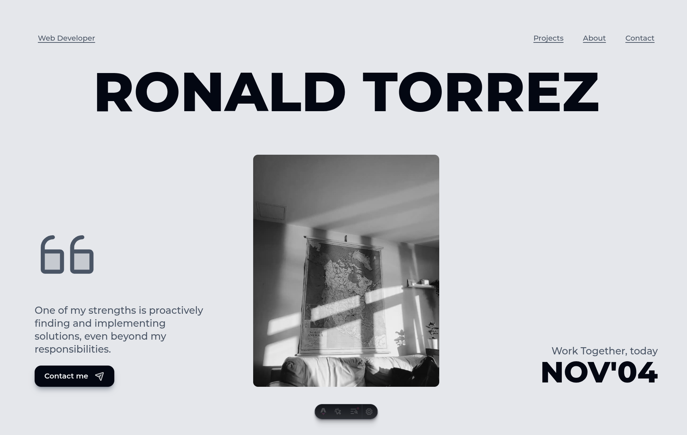

# Personal Portfolio – Astro Website



## 📌 Project Overview

This repository contains the source code for my personal portfolio website built with **Astro**. It is a fast,
content-driven, single-page site that showcases my profile, skills, and selected client work.

The main sections of the site are:

- **Header / Hero** – Intro, strong headline, and main call-to-action.
- **About Me** – Short biography and background.
- **Services** – What I offer (e.g., web development, WordPress, e‑commerce, etc.).
- **Skills / Tech Stack** – Technologies and tools I use, visualized with logos.
- **Selected Work / Websites** – A curated list of projects with thumbnails, descriptions, and links.
- **Contact** – Contact form / links for getting in touch.
- **Footer** – Copyright, social links, and navigation.

The page is rendered mainly from `src/pages/index.astro` using a shared layout in `src/layouts/Layout.astro` and a set
of reusable components.

---

## ✨ Features

- **Static, blazing‑fast personal site** built on Astro 5.
- **Content collections** using `astro:content` and MDX for projects.
- **Typed content schemas** for projects and logos.
- **Reusable components** for each section (`Header`, `SelectedWork`, `Services`, `Skills`, `AboutMe`, `Contact`,
  `Footer`, `NavBar`).
- **UI primitives** (buttons, headings, dates, video wrapper, coming soon) in `src/components/UI`.
- **Responsive images & assets** for headers, profile photo, project backgrounds, and thumbnails.
- **SEO friendly** with meta tags, Open Graph, and Twitter cards configured in the layout.
- **Sitemap & robots** via Astro integrations and a typed `robots.txt` endpoint.
- **Performance focused** with compression and modern best practices.

---

## 🛠 Tech Stack

**Core**

- [Astro](https://astro.build/) – Static site framework.
- [TypeScript](https://www.typescriptlang.org/) – Strict typing across the project.
- [pnpm](https://pnpm.io/) – Package manager.

**Styling**

- Utility‑first CSS powered by Tailwind‑style classes.
- Global styles defined in `src/styles/global.css`.

**Content & Data**

- `astro:content` collections configured in `src/content.config.ts`.
- MDX projects in `src/content/projects/websites`.
- Logo metadata loaded from `src/assets/logos/content.json`.
- Schemas for structured content in `src/schemas/content`.

**Tooling & Quality**

- TypeScript configuration in `tsconfig.json`.
- Linting via `eslint.config.ts`.
- Opinionated formatting via Prettier (through ESLint config and Astro defaults).

---

## 📁 Project Structure

High‑level overview of the most important folders and files:

```text
/
├── astro.config.mjs        # Astro configuration and integrations
├── package.json            # Scripts, dependencies, metadata
├── tsconfig.json           # TypeScript configuration
├── eslint.config.ts        # ESLint configuration
├── public/
│   ├── favicon.svg
│   └── og-default.png      # Default Open Graph image
└── src/
    ├── assets/
    │   ├── header-img.webp # Homepage hero image
    │   ├── photo.webp      # Profile photo
    │   ├── logos/          # Technology & tool logos (.svg) and content.json
    │   └── projects/
    │       └── websites/   # Project backgrounds and thumbnails
    ├── components/
    │   ├── AboutMe.astro
    │   ├── CardViewMore.astro
    │   ├── Contact.astro
    │   ├── Footer.astro
    │   ├── Header.astro
    │   ├── NavBar.astro
    │   ├── SelectedWork.astro
    │   ├── ServiceList.astro
    │   ├── Services.astro
    │   ├── SkillList.astro
    │   ├── Skills.astro
    │   ├── WebsiteItem.astro
    │   └── UI/
    │       ├── Button.astro
    │       ├── ComingSoon.astro
    │       ├── Heading.astro
    │       ├── ShortDate.astro
    │       └── Video.astro
    ├── content/
    │   └── projects/
    │       └── websites/   # Project entries as MDX (e.g. bestone.mdx, ...)
    ├── layouts/
    │   └── Layout.astro    # Global HTML shell, meta tags, and shared layout
    ├── pages/
    │   ├── index.astro     # Main landing page
    │   └── robots.txt.ts   # Robots.txt endpoint
    ├── schemas/
    │   ├── string.ts
    │   └── content/
    │       ├── logo.schema.ts
    │       └── website.schema.ts
    ├── styles/
    │   └── global.css      # Global and utility styles
    └── utils/
        ├── case.ts
        ├── const.ts
        ├── css.ts
        ├── date.ts
        └── getValuesBy.ts
```

---

## 🚀 Getting Started

### Prerequisites

- **Node.js** – Use an active LTS version.
- **pnpm** – Install globally if you do not have it yet:

```bash
npm install -g pnpm
```

### Installation

Clone the repository and install dependencies:

```bash
git clone https://github.com/ronaldtorrez/personal-website.git
cd personal-website
pnpm install
```

### Local Development

Start the development server:

```bash
pnpm dev
```

Then open the printed local URL in your browser (for example `http://localhost:4321`).

### Build & Preview

Create an optimized production build:

```bash
pnpm build
```

Preview the built site locally:

```bash
pnpm preview
```

---

## 🔐 Environment Variables

This project is prepared to use **Doppler** (https://doppler.com) to manage environment variables for both `dev` and
`prod` environments.

The main variables are:

- `FORM_BASE_URL` – Base URL for your form backend or service.
- `FORM_EMAIL` – Email address used as the main contact/recipient.
- `FORM_SUBMIT_URL` – Full URL endpoint where form submissions are sent.
- `PUBLIC_CLOUDINARY_CLOUD_NAME` – Cloud name used for Cloudinary assets on the public side.

### Using Doppler (recommended)

If you use Doppler, you can create projects and configs (e.g. `dev` and `prod`), define these variables there, and then
run the existing npm scripts that integrate Doppler into the Astro dev/build commands (see `package.json`). This keeps
secrets out of your local `.env` files and makes it easier to keep environments in sync.

### Using a local `.env` file (alternative)

If you don’t want to use Doppler, you can create a local `.env` file instead. For example:

```bash
FORM_BASE_URL="https://api.your-service.com"
FORM_EMAIL="you@example.com"
FORM_SUBMIT_URL="https://api.your-service.com/forms/contact"
PUBLIC_CLOUDINARY_CLOUD_NAME="your-cloud-name"
```

**Important:**

- Never commit `.env` files or real secrets to the repository.
- Use `.gitignore` to ensure `.env` is ignored.
- For production deployments (Vercel, Netlify, etc.), set these variables directly in the hosting provider’s
  environment settings.

---

## ✏️ Managing Content

### Projects (Websites)

Projects are stored as **MDX files** in `src/content/projects/websites`.

Each file (for example `bestone.mdx`) represents a single website project and usually contains:

- **Frontmatter** with metadata such as title, slug, date, short description, links, and technologies.
- **Body content** describing the project, goals, process, and results.

These entries are typed and validated using the schema defined in `src/schemas/content/website.schema.ts`.

**To add a new project:**

1. Create a new file in `src/content/projects/websites`, for example:
    - `my-new-project.mdx`
2. Add the required frontmatter fields (at least: title, slug, summary/description, date, and any custom fields defined
   in the schema).
3. Write the project description in the MDX body.
4. Add any corresponding images to `src/assets/projects/websites` (background and/or thumbnail) and reference them from
   the frontmatter or body.
5. Run `pnpm dev` and check that the new project appears in the **Selected Work** section and renders correctly.

### Logos & Skills

Logos for the skills/tech stack section live under `src/assets/logos`.

- SVG logo files are stored in `src/assets/logos/*.svg`.
- Their metadata (name, slug, path, etc.) is managed via `src/assets/logos/content.json` and validated using
  `src/schemas/content/logo.schema.ts`.

To add a new logo:

1. Place the SVG file in `src/assets/logos`.
2. Add a corresponding entry to `src/assets/logos/content.json` following the existing structure.
3. The new logo can then be used in skills or project components via the content utilities.

---

## 🎨 Styling & UI

- Global base styles and variables live in `src/styles/global.css`.
- Components use utility classes to define layout, spacing, and typography.
- Shared UI primitives in `src/components/UI` (buttons, headings, date labels, video wrapper, etc.) help keep the design
  consistent across the site.

If you update the design, try to do it through these shared components and global styles first.

---

## 🔍 SEO & Performance

SEO and performance are first‑class concerns in this project:

- Meta tags, favicon, and Open Graph/Twitter cards are configured in `src/layouts/Layout.astro`.
- A typed `robots.txt` endpoint lives in `src/pages/robots.txt.ts`.
- A sitemap integration can be enabled/configured in `astro.config.mjs` for better indexing.
- Static output is small and fast, ideal for deployment on global CDNs.

---

## 🧪 Linting & Quality

The project includes basic linting and formatting support:

- **ESLint** configuration in `eslint.config.ts`.
- **TypeScript** type checking via Astro/TS tooling.

Useful commands (if configured in `package.json`):

```bash
pnpm lint   # Run ESLint
```

Check `package.json` for additional scripts such as format, typecheck, etc.

---

## 📦 Deployment

This project builds to a static site in the `dist` directory. You can deploy it on any static hosting provider.

### Generic Static Hosting

1. Build the site:
    ```bash
    pnpm build
    ```
2. Upload the contents of the `dist` folder to your hosting provider (e.g., GitHub Pages, Netlify, Vercel, Cloudflare
   Pages, or your own server).

### Vercel (example)

- Import the repository into Vercel.
- Framework preset: **Astro** (usually auto‑detected).
- Install command: `pnpm install`.
- Build command: `pnpm build`.
- Output directory: `dist`.

### Netlify (example)

- Connect the repository on Netlify.
- Build command: `pnpm build`.
- Publish directory: `dist`.

Configure any environment variables in your hosting provider’s dashboard if you introduce them later.

---

## 👤 Author

This is my personal website/portfolio. You can adapt these fields to your own information if you fork the project.

- **Name:** _Ronald Torrez_
- **Website:** _https://ronaldtorrez.com_
- **GitHub:** _https://github.com/ronaldtorrez_
- **Twitter/X:** _@ronaldtorrez0_

Update this section with your actual details.

---

## 📄 License

This project is licensed under the **MIT License**.

You are free to use, copy, modify, merge, publish, distribute, sublicense, and/or sell copies of the software, subject
to the conditions described in the license.

For the full license text, see the [`LICENSE`](./LICENSE) file in the root of this repository.

You are free to adjust or extend this README to better describe your own workflow and preferences.
